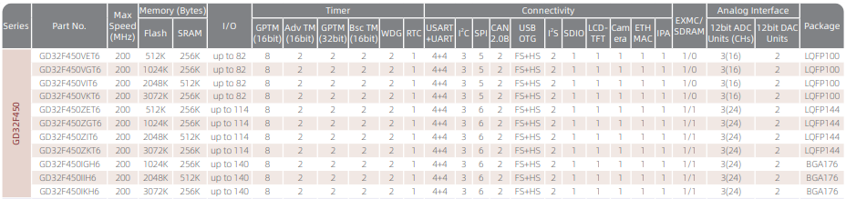

# [GD32F450](https://github.com/SoCXin/GD32F450)

#### [Vendor](https://github.com/SoCXin/Vendor)：[GigaDevice](https://www.gigadevice.com/)
#### [Core](https://github.com/SoCXin/Cortex)：[Cortex M4](https://github.com/SoCXin/CM4)
#### [Level](https://github.com/SoCXin/Level)：200MHz
## [GD32F450描述](https://github.com/SoCXin/GD32F450/wiki)

[GD32F450](https://github.com/SoCXin/GD32F450)

<!--  -->

##### 关键特性

* IPA
* ETH-MAC
* USB(OTG)
* CAN
* 封装(LQFP144/LQFP100/BGA176)

### [资源收录](https://github.com/SoCXin/GD32F450)

* [参考文档](docs/)
* [参考资源](src/)
* [参考工程](project/)

### [选型建议](https://github.com/SoCXin)

[GD32F450](https://github.com/SoCXin/GD32F450)

###  [SoC.芯](http://www.SoC.Xin)
